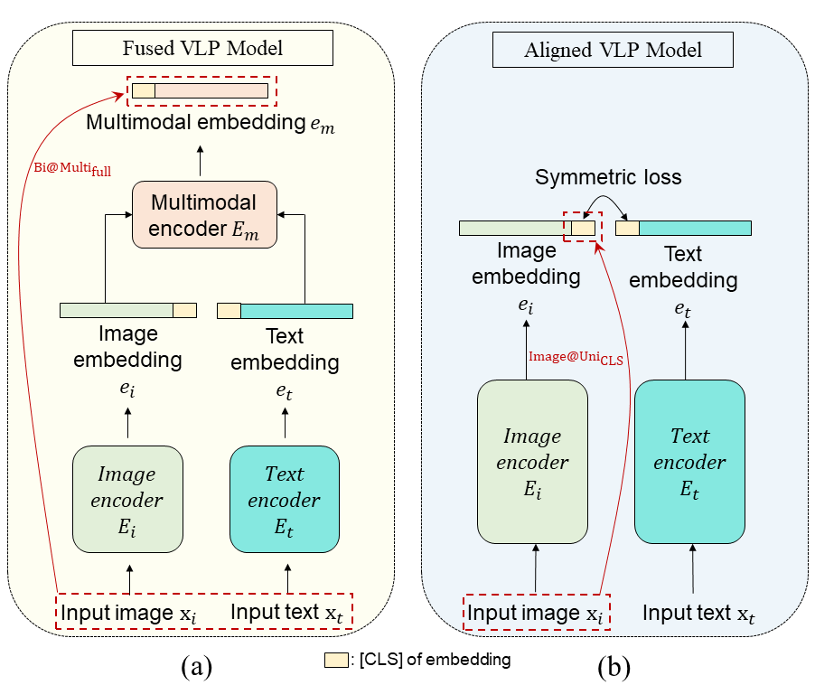

# [Towards Adversarial Attack on Vision-Language Pre-training Models](https://arxiv.org/abs/2206.09391)

This is the official PyTorch implement of the paper "[Towards Adversarial Attack on Vision-Language Pre-training Models](https://arxiv.org/abs/2206.09391)" at *ACM Multimedia 2022*. 

<!--  -->

## Requirements
- pytorch 1.10.2
- transformers 4.8.1
- timm 0.4.9
- bert_score 0.3.11


## Download
- Dataset json files for downstream tasks [[ALBEF github]](https://github.com/salesforce/ALBEF)
- Finetuned checkpoint for ALBEF [[ALBEF github]](https://github.com/salesforce/ALBEF)
- Finetuned checkpoint for TCL [[TCL github]](https://github.com/uta-smile/TCL)


## Evaluation
### Image-Text Retrieval
Download MSCOCO or Flickr30k datasets from origin website.
```
# Attack Unimodal Embedding
python RetrievalEval.py --adv 4 --gpu 0 --cls \
--config configs/Retrieval_flickr.yaml \
--output_dir output/Retrieval_flickr \
--checkpoint [Finetuned checkpoint]

# Attack Multimodal Embedding
python RetrievalFusionEval.py ...
```

### Visual Entailment
Download SNLI-VE datasets from origin website.
```
# Attack Unimodal Embedding
python VEEval.py --adv 4 --gpu 0 --cls \
--config configs/VE.yaml \
--output_dir output/VE \
--checkpoint [Finetuned checkpoint]

# Attack Multimodal Embedding
python VEFusionEval.py ...
```

### Visual Grounding
Download MSCOCO dataset from the original website.
```
# Attack Unimodal Embedding
python GroundingEval.py --adv 4 --gpu 0 --cls \
--config configs/Grounding.yaml \
--output_dir output/Grounding \
--checkpoint [Finetuned checkpoint]

# Attack Multimodal Embedding
python GroundingFusionEval.py ...
```

## Visualization
```
python visualization.py --adv 4 --gpu 0
```
## Citation
```
@inproceedings{zhang2022towards,
  title={Towards Adversarial Attack on Vision-Language Pre-training Models},
  author={Zhang, Jiaming and Yi, Qi and Sang, Jitao},
  booktitle="Proceedings of the 30th ACM International Conference on Multimedia",
  year={2022}
}
```
